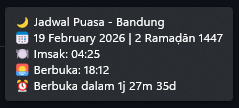
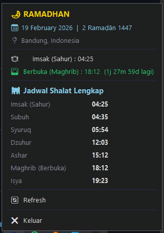

# 🌙 Ramadan Fasting Schedule — Windows Taskbar App

Aplikasi system tray Windows yang menampilkan jadwal puasa Ramadhan secara real-time berdasarkan lokasi.


<p align="center">
  
  &nbsp;&nbsp;
  
</p>

---

## ✨ Fitur

| Fitur | Deskripsi |
|-------|-----------|
| 🌙 **System Tray Icon** | Ikon bulan sabit dengan countdown dinamis |
| 📋 **Dark Menu** | Klik kiri → popup menu gelap bertema modern |
| 📋 **Native Menu** | Klik kanan → menu native Windows dengan jadwal lengkap |
| 📍 **Auto Lokasi** | Deteksi lokasi otomatis via IP geolocation |
| 🏙️ **Pilihan Kota** | 20+ kota Indonesia & 10 kota internasional |
| 🔔 **Notifikasi** | Desktop notification untuk Imsak & Berbuka |
| ⏰ **Countdown** | Hitung mundur ke waktu Imsak / Berbuka |
| 🕌 **Jadwal Lengkap** | 7 waktu shalat (Imsak, Subuh, Syuruq, Dzuhur, Ashar, Maghrib, Isya) |
| 🔄 **Auto Refresh** | Update otomatis setiap 30 detik |
| 🔒 **Single Instance** | Hanya 1 instance berjalan, otomatis tutup yang lama |

---

## 📁 Struktur Proyek

```
ramadhan-windows-taskbar/
├── main.py                          # Entry point
├── config.json                      # User configuration
├── requirements.txt                 # Python dependencies
├── README.md
├── .gitignore
│
├── src/                             # Source code
│   ├── __init__.py
│   ├── app.py                       # RamadhanTrayApp class & single instance
│   │
│   ├── config/                      # Configuration
│   │   ├── __init__.py
│   │   └── manager.py              # Config load/save, city database
│   │
│   ├── services/                    # Business logic
│   │   ├── __init__.py
│   │   ├── location.py             # IP geolocation & city lookup
│   │   ├── prayer_times.py         # Aladhan API integration
│   │   └── notification.py         # Desktop notifications
│   │
│   └── ui/                          # User interface
│       ├── __init__.py
│       ├── icon.py                  # Dynamic tray icon generator
│       ├── menu.py                  # Custom dark popup menu
│       └── settings.py             # Settings window (Tkinter)
│
└── tests/                           # Test suite
    ├── __init__.py
    └── test_integration.py          # Integration tests
```

---

## 🚀 Instalasi & Menjalankan

### Prasyarat

- **Python 3.10+**
- **Windows 10/11**

### Setup

```bash
# Clone repository
git clone https://github.com/iqbbal/Ramadan-Fasting-Schedule.git
cd Ramadan-Fasting-Schedule

# Buat virtual environment
python -m venv .venv
.venv\Scripts\activate

# Install dependencies
pip install -r requirements.txt
```

### Menjalankan

```bash
python main.py
```

Aplikasi akan muncul sebagai ikon 🌙 di system tray (pojok kanan bawah taskbar).

---

## 🖱️ Cara Penggunaan

| Aksi | Fungsi |
|------|--------|
| **Hover** ikon | Melihat tooltip jadwal & countdown |
| **Klik kiri** ikon | Membuka dark popup menu |
| **Klik kanan** ikon | Membuka native menu dengan jadwal lengkap |

---

## ⚙️ Konfigurasi

File `config.json` menyimpan pengaturan:

```json
{
    "location_mode": "auto",
    "city": "",
    "calculation_method": 20,
    "notification_before_imsak_minutes": 10,
    "notification_at_iftar": true
}
```

| Parameter | Deskripsi |
|-----------|-----------|
| `location_mode` | `"auto"` (IP) atau `"manual"` (pilih kota) |
| `calculation_method` | `20` = Kementerian Agama RI (KEMENAG) |
| `notification_before_imsak_minutes` | Notifikasi N menit sebelum Imsak |
| `notification_at_iftar` | Notifikasi saat waktu berbuka |

---

## 📦 Dependencies

| Package | Fungsi |
|---------|--------|
| `pystray` | System tray icon |
| `Pillow` | Pembuatan ikon dinamis |
| `requests` | HTTP API calls |
| `win10toast` | Desktop notifications |
| `psutil` | Single-instance management |
| `schedule` | Task scheduling |

---

## 🕌 API

Menggunakan [Aladhan Prayer Times API](https://aladhan.com/prayer-times-api) (gratis, tanpa API key).

Metode perhitungan default: **Kementerian Agama Republik Indonesia (KEMENAG)**.

---

## 📄 Lisensi

MIT License — Silakan digunakan dan dimodifikasi sesuai kebutuhan.
